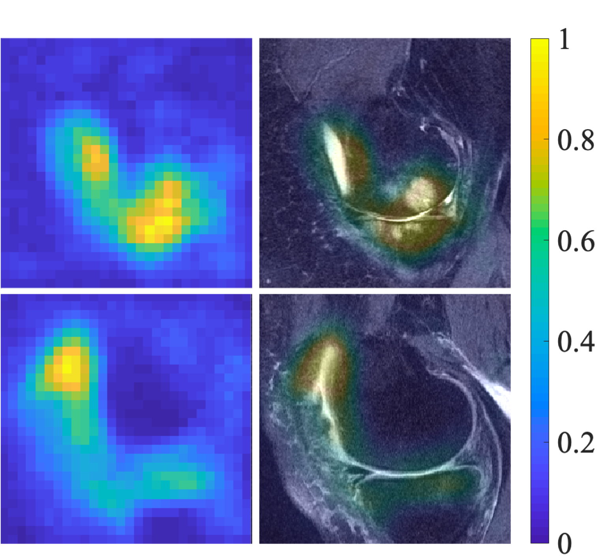

# Assessment of knee pain from MR imaging using a convolutional Siamese network

This work is published in *European Radiology* (https://doi.org/10.1007/s00330-020-06658-3).

 

### Prerequisites

The tool was developed based on the following dependencies:

1. PyTorch (1.1 or greater).
2. NumPy (1.16 or greater).
3. Scipy (1.30 or greater)
4. OpenCV (3.4.2 or greater)
5. scikit-learn (0.21.2 or greater)

Please note that the dependencies require Python 3.6 or greater. We recommend installation and maintenance of all packages using [`conda`](https://www.anaconda.com/). For installation of GPU accelerated PyTorch, additional effort may be required. Please check the official websites of [PyTorch](https://pytorch.org/get-started/locally/) and [CUDA](https://developer.nvidia.com/cuda-downloads) for detailed instructions.

### Data files
Pairs of images and masks of segmentation should be put in:
```bash
data/CASE_NAME/train_imgs/*.npy
data/CASE_NAME/train_masks/*.npy
```
for training dataset and
```bash
data/CASE_NAME/eval_imgs/*.npy
data/CASE_NAME/eval_masks/*.npy
```
for validation dataset. 
The labels used for classification should be put as:
```bash
data/CASE_NAME/label.npy
```

## <a name="Arguments"></a>Arguments

1 . `--rp`:
>> Run using multiple GPUs in parallel.

2 .  `--r`:
>> Run along with linear registration.

3 . `--c`:
>> Run using the saved checkpoints.

4 . `--lr`: *float*
>> Learning rate, default is 1e-4

5 . `--gamma`: *float*

>> Learning rate decay, default is 1.0

6 . `--epochs`: *int*
>> Number of epochs, default is 500

7 . `--bs`: *int*
>> Batch size, default is 64
